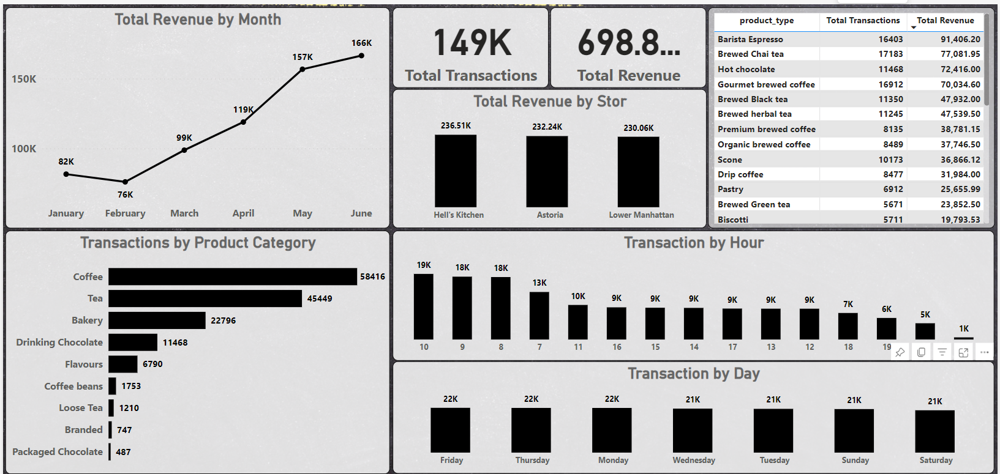

## 1- Dashboard :
  

  

## 2- About the Dataset :
Transaction records for Maven Roasters, a fictitious coffee shop operating out of three NYC locations. Dataset includes the transaction date, timestamp and location, along with product-level details.
____________________________________________________________________________
## 3- Data Description :
- `transaction_id` : Unique sequential ID representing an individual transaction
- `transaction_date` : Date of the transaction (MM/DD/YY)
- `transaction_time` : Timestamp of the transaction (HH:MM:SS)
- `transaction_qty` : Quantity of items sold
- `store_id` : Unique ID of the coffee shop where the transaction took place
- `store_location` : Location of the coffee shop where the transaction took place
- `product_id` : Unique ID of the product sold
- `unit_price` : Retail price of the product sold
- `product_category` : Description of the product category
- `product_type` : Description of the product type
- `product_detail` : Description of the product detail
_________________________________________________________________________________
## 4- In Mind Questions
- **General Questions related to the existence of**
  - missing values?
  - wrong datatypes for columns?
  - complete duplicates in the data?
  - outliers in each column?
  
- ** Recommended Analysis**
    - How have Maven Roasters sales trended over time?

    - Which days of the week tend to be busiest, and why do you think that's the case?

    - Which products are sold most and least often? Which drive the most revenue for the business?
________________________________________________________________________________
## 5- Conclusion

- `Year`, Sales exclusively from 2023.
- `Month`, Most sales within a six-month period 
- `Hour`, Most sales were from 8 am to 11 pm
- `Transaction quantity`, Most sales were singles followed by 2 lots
- `Stores`, The sales rates of the three stores were similar, with the most significant difference observed at the `Hell's Kitchen` store
- `Unit price`, Price distribution is `positively skewed`, We understand from this that most Coffee have lower prices,while a few Coffee have higher prices
- **Category :**
     - it's evident that the three stores offer a wide range of services.
     - `Coffee` stands as the best-selling product.
     - `Tea` also exhibits a high sales rate.
- **product type :**
     - In the `Bakery` category, the most sold item is the *scone*
     - In the `Branded` category, the best-selling item is *Housewares*
     - In the `Coffee` category, the best-selling item is *Gourmet brewed coffee*
     - In the `Coffee beans` category, the best-selling item is *Organic Beans*
     - The `Drinking Chocolate` category solely offers *hot chocolate*
     - `Regular syrup` are the top-selling items in the *Flavours* category
     - In the `Loose Tea` category, the best-selling item is *Chai tea*
     - In the `Packaged Chocolate` category, the best-selling item is *Drinking Chocolate*
     - In the `Tea` category, the best-selling item is *Brewed Chai tea*

